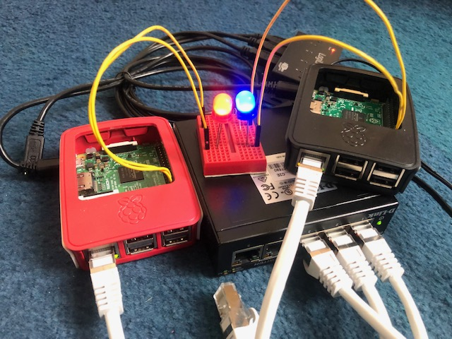

# Raspberry Pi Kubernetes cluster with OpenFaaS function to turn on LED

This repository describes the installation of a 2-node Raspberry Pi Kubernetes cluster using **k3s** - Kubernetes distribution built for IoT & Edge computing.
Kubernetes dashboard and **OpenFaaS** are deployed using **Arkade**. An OpenFaaS function to turn on an LED light is deployed in two replicas, one on each node, and is used to demonstrate load balancing in action.

https://medium.com/@alexellisuk/walk-through-install-kubernetes-to-your-raspberry-pi-in-15-minutes-84a8492dc95a

https://blog.alexellis.io/test-drive-k3s-on-raspberry-pi/

https://k3s.io/

https://rancher.com/docs/k3s/latest/en/quick-start/



# Network configuration

Use `wpa_passphrase` to generate a WPA PSK from an ASCII password and add the configuration to `wpa_supplicant.conf`.

```
nmap -sP 192.168.2.*
```

Copy your public key to `~/.ssh/authorized_keys` on all Raspberry Pi's.

```
sudo apt-get update
sudo apt-get install -y vim nmap
```

### Master

```
# kmaster
ssh pi@192.168.2.135
```

`/etc/dhcpcd.conf`

```
interface eth0
static ip_address=10.0.0.10/24
#static routers=10.0.0.1
#static domain_name_servers=10.0.0.1
```

```
echo -e "10.0.0.11\tknode1" | sudo tee -a /etc/hosts
```

### Node

```
# knode1
ssh pi@192.168.2.134
```

`/etc/dhcpcd.conf`

```
interface eth0
static ip_address=10.0.0.11/24
#static routers=10.0.0.1
#static domain_name_servers=10.0.0.1
```

```
echo -e "10.0.0.10\tkmaster" | sudo tee -a /etc/hosts
```

```
nmap -sP 10.0.0.*

route -n
ip route show
netstat -rn
```

# k3s

### Master

```
# kmaster
ssh pi@192.168.2.135

curl -sfL https://get.k3s.io | sh -

sudo kubectl get nodes

sudo cat /var/lib/rancher/k3s/server/node-token

sudo cat /etc/rancher/k3s/k3s.yaml
```

### Node

```
# knode1
ssh pi@192.168.2.134

curl -sfL http://get.k3s.io | K3S_URL=https://kmaster:6443 \
K3S_TOKEN=... sh -
```

```
export KUBECONFIG=`pwd`/k3s.yaml

kubectl get pods --all-namespaces
```

# Install applications

Use Arkade to install applications on the k3s cluster.

https://github.com/alexellis/arkade

```
curl -sSL https://dl.get-arkade.dev | sudo sh

arkade install --help
```

### kube-dashboard

https://rancher.com/docs/k3s/latest/en/installation/kube-dashboard/

```
arkade install kubernetes-dashboard
```

```
#To forward the dashboard to your local machine
kubectl proxy

#To get your Token for logging in
kubectl -n kubernetes-dashboard describe secret $(kubectl -n kubernetes-dashboard get secret | grep admin-user-token | awk '{print $1}')

# Once Proxying you can navigate to the below
http://localhost:8001/api/v1/namespaces/kubernetes-dashboard/services/https:kubernetes-dashboard:/proxy/#/login
```

```
kubectl create -f dashboard.admin-user.yml -f dashboard.admin-user-role.yml

kubectl -n kubernetes-dashboard describe secret admin-user-token | grep ^token
```

### OpenFaaS

```
arkade install openfaas
```

OpenFaaS can be accessed using a NodePort on 31112.

```
PASSWORD=$(kubectl get secret -n openfaas basic-auth -o jsonpath="{.data.basic-auth-password}" | base64 --decode; echo)

export OPENFAAS_URL=http://192.168.2.135:31112

echo -n $PASSWORD | faas-cli login --username admin --password-stdin

faas-cli store list --platform armhf

faas-cli store deploy figlet --platform armhf

faas-cli list

echo -n k3s | faas-cli invoke figlet
curl http://192.168.2.135:31112/function/figlet -d "k3s"
```

# OpenFaaS function to turn on LED

A simple OpenFaaS function that turns on an LED light on the Raspberry Pi can be found in the repository.

This function is deployed in two instances, one on each k3s node.
Every time the function is invoked, an LED light blinks on the node where the function is deployed.
In this way, we can see load balancing in action!

```
export USERNAME=salekd
docker login -u $USERNAME

faas-cli template store pull python3-armhf
faas-cli new --lang python3-armhf faas-rpi-led

faas-cli build -f faas-rpi-led.yml --build-arg ADDITIONAL_PACKAGE="gcc musl-dev"
faas-cli push -f faas-rpi-led.yml

faas-cli deploy -f faas-rpi-led.yml
```

Running in a privileged mode is required for accessing GPIO pins.

```
kubectl edit deployment/faas-rpi-led -n openfaas-fn
```

```
    securityContext:
      privileged: True
```

Test load balancing by continuously invoking the function in parallel.

```
curl http://192.168.2.135:31112/function/faas-rpi-led
curl http://192.168.2.135:31112/function/faas-rpi-led > /dev/null 2>&1 &

while :; do curl http://192.168.2.135:31112/function/faas-rpi-led > /dev/null 2>&1; done
```
